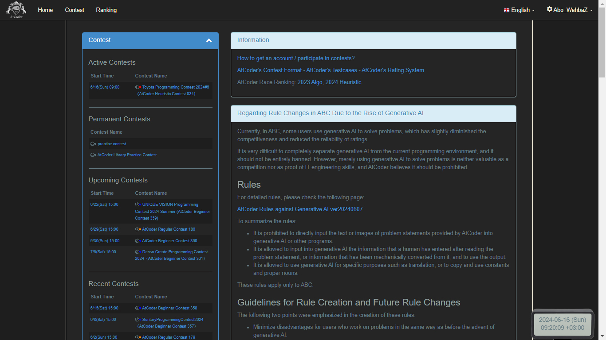

# AtCoder Theme : Refined Dark Theme :new_moon_with_face:

### Original Theme by : [magurofly](https://github.com/magurofly)

### Modified by : [abowahbaz](https://github.com/abowahbaz)

# Preview :eyes:

# Installation :gear:

1. You need to have **Tampermonkey** installed in your browser. You can download it from [here](https://www.tampermonkey.net/).
2. Make sure to apply the developer mode in your browser.
3. Install the script by clicking [here](atcoder-dark-theme.user.js) , then clicking on `Raw` button.
4. Go to [AtCoder](https://atcoder.jp/), and you should see the dark theme.
5. Enjoy! :tada:

# Contribution :handshake:

### Feel free to contribute to this project by opening an issue or a pull request. :smile:

# Modified with :heart: by [abowahbaz](https://github.com/abowahbaz)
